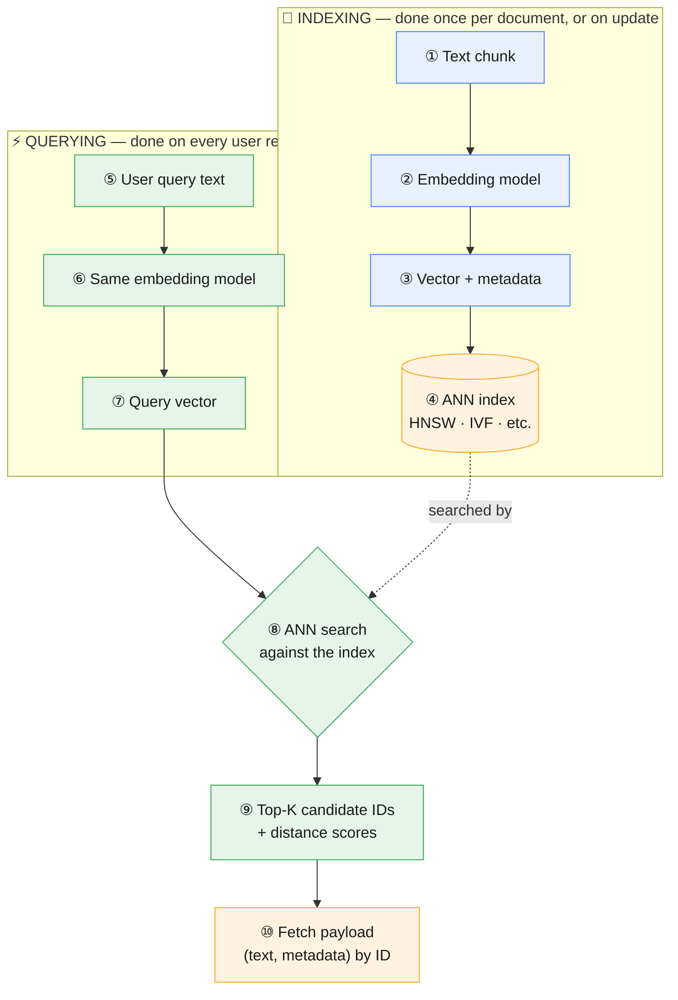

# Vector Databases, from Scratch

**Prev:** [[04 - Indexing and Vector Stores]] · **Next:** [[04.2 - Vector Similarity Metrics]]

---

## Interview one-liner

A vector database is a database built around one operation: **"give me the K stored vectors closest to this query vector, fast, even among a billion rows"** — everything else (index types, similarity metrics, hybrid search) exists to make that one operation both fast and accurate.

---

## In plain English

You already know a normal database: you store rows, and you look them up by an exact match — `WHERE user_id = 42`. A vector database stores **embeddings** (lists of numbers that represent meaning — see [[03 - Embedding Model Choice]]) and answers a completely different kind of question: not "give me the row that matches exactly," but **"give me the rows whose meaning is closest to this one."**

That single shift — from exact match to *nearest neighbor* — is why vector databases exist as their own category of tool, with their own indexing strategies, query language, and failure modes.

---

## Why you can't just use a normal database for this

A normal `WHERE` clause or B-tree index is built for exact or range matches on scalar values (numbers, strings, dates). It has no way to answer "which of these 10 million 1536-dimensional vectors is closest to this one" — that requires computing a **distance** between the query vector and every candidate.

The brute-force way — compare the query against every single stored vector — actually works and is exact:

$$\text{time complexity} = O(n \cdot d)$$

where $n$ = number of stored vectors, $d$ = dimensionality (often 384–1536). Fine for thousands of vectors. Falls apart at millions: every single query would take seconds, and a production RAG system needs sub-100ms responses. That's the entire reason **Approximate Nearest Neighbor (ANN)** indexes exist — full depth in [[04.3 - Vector Index Types and ANN Algorithms]].

---

## The two things every vector DB stores per entry

| Field | What it is | Real example |
|-------|----------------|----------------|
| **Vector (embedding)** | The list of numbers from your embedding model | `[0.012, -0.44, 0.81, ...]` (1536 numbers for OpenAI's `text-embedding-3-small`) |
| **Payload / metadata** | Everything else you'll want back or want to filter by | The original text chunk, source document, page number, department, date, access-control tags |

A vector database is **not** a document store first — it's an index over the vector field, with the payload carried along for the ride. This is why "the vector DB stores my documents" is a common misconception: it stores vectors, plus whatever payload you chose to attach.

---

## The full lifecycle

**① → ④ happens offline, ahead of time.** **⑤ → ⑩ happens on every single query, and has to be fast.** The one hard rule connecting them: **② and ⑥ must be the exact same embedding model** — if you index with one model and query with another, the vectors live in different, incompatible geometric spaces, and "closest" becomes meaningless. This is the single most common real-world vector DB bug.

---

## Step-by-step

**① Text chunk.** A piece of a document, sized to fit both the embedding model's input limit and to stay topically coherent — see [[02 - Chunking Strategy]].

**② Embedding model.** Converts text into a fixed-length vector of floating point numbers. The model defines the "geometry" — what counts as close.

**③ Vector + metadata.** The number list, plus whatever you'll want to filter on or display later (source, date, tags, the raw text itself or a pointer to it).

**④ ANN index.** ANN (Approximate Nearest Neighbor) A data structure built specifically to answer "nearest neighbors" queries fast, trading a small amount of accuracy for a huge speed gain. Not a single algorithm — several competing designs exist (HNSW, IVF, PQ), each with different speed/memory/accuracy tradeoffs — see [[04.3 - Vector Index Types and ANN Algorithms]].

**⑤-⑦ Query embedding.** The exact same transformation as indexing, applied to the user's question instead of a document chunk.

**⑧ ANN search.** The index is walked (not brute-force scanned) to find candidates likely to be close, using whichever similarity metric the index was built with — see [[04.2 - Vector Similarity Metrics]].

**⑨ Top-K + scores.** The result isn't just IDs — it's IDs ranked by distance/similarity score, which lets you apply a cutoff or feed the score into a reranker.

**⑩ Fetch payload.** The vector DB (or a separate lookup) returns the actual text/metadata for those top-K IDs, ready to hand to the LLM as context.

---

## Vector DB vs traditional DB vs search engine

| | Traditional DB (Postgres) | Search engine (Elasticsearch) | Vector DB (Pinecone, Qdrant, ...) |
|---|-----------------------------|-------------------------------|---------------------------------------|
| **Finds by** | Exact match / range on structured fields | Keyword match, ranked by term frequency (BM25) | **Semantic similarity** between vectors |
| **Good at** | "Get order #4521" | "Documents containing 'invoice overdue'" | "Documents that *mean* the same as this question," even with zero shared words |
| **Blind spot** | Can't search by meaning | Misses paraphrases / synonyms | Can miss exact codes/SKUs a keyword search would nail instantly |
| **In practice** | Often stores the payload alongside vectors (e.g. pgvector = both in one) | Often combined *with* vector search (hybrid) | Often combined *with* keyword search (hybrid) — see [[05 - Retrieval Quality]] |

---

## Common traps

| Trap | Why it's wrong | What to say instead |
|------|------------------|----------------------|
| "The vector DB stores my documents" | It stores vectors + whatever payload you chose to attach — not automatically the full document | "I'd design the payload schema deliberately, deciding what's stored vs just referenced" |
| Indexing with one embedding model, querying with another | Vectors from different models live in incompatible spaces — similarity scores become meaningless | "Index and query must always use the exact same embedding model" |
| Assuming ANN search is exact | It trades a small amount of recall for a massive speed gain — a true nearest neighbor can occasionally be missed | "I'd tune the index's accuracy/speed knobs (e.g. `ef_search`, `nprobe`) based on how much recall loss is acceptable" |
| Treating "vector DB" as one single technology | Different products make very different tradeoffs — managed vs self-hosted, filtering support, scale | "I'd pick based on the actual requirements — see [[04.4 - Vector Database Frameworks Compared]]" |

---

**Next:** [[04.2 - Vector Similarity Metrics]]
