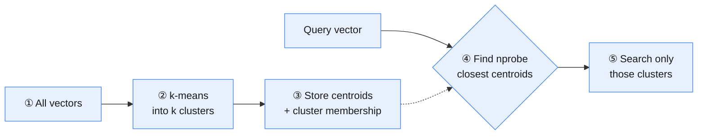

# Vector Index Types and ANN Algorithms

**Prev:** [[04.2 - Vector Similarity Metrics]] · **Next:** [[04.4 - Vector Database Frameworks Compared]]

---

## Interview one-liner

Every ANN index is the same trade: give up the guarantee of finding the *exact* nearest neighbor, in exchange for finding a neighbor that's *almost certainly* close enough, orders of magnitude faster. Which index you pick just decides *how* you give up that guarantee — by clustering (IVF), by building a navigable graph (HNSW), or by compressing (PQ).

---

## In plain English

Comparing a query against every single stored vector (**Flat / brute-force**) is exact, but its cost grows linearly with the number of vectors — fine for 10,000 vectors, unusable for 100 million. Every other index type in this note exists to answer the same question — "which vectors are closest?" — without checking all of them, by being smart about *which* vectors to check.

---

## Flat (brute-force) — the baseline

Compares the query against **every** stored vector, exactly.

$$\text{Query time} = O(n \cdot d)$$

| | |
|---|---|
| **Recall** | 100% — always exact |
| **Best for** | Small corpora (a few thousand to ~100k vectors), or as a correctness baseline to measure other indexes against |
| **Weakness** | Doesn't scale — a linear scan of 50M vectors per query is far too slow for production |

---

## IVF (Inverted File Index) — cluster first, then search

**Idea:** at build time, run k-means to group all vectors into $k$ clusters, each with a centroid. At query time, only search the clusters whose centroids are closest to the query — skip the rest entirely.

| Parameter | What it controls | Tradeoff |
|-----------|----------------------|-----------|
| `nlist` (number of clusters) | How finely the space is partitioned | More clusters = finer partitioning, but more centroids to compare at query time |
| `nprobe` (clusters searched per query) | How many clusters get checked | Higher `nprobe` = better recall, closer to brute-force cost; lower = faster but riskier (a true neighbor in an unsearched cluster gets missed entirely) |

| | |
|---|---|
| **Recall** | Tunable via `nprobe` — trade speed for accuracy directly |
| **Best for** | Very large datasets where memory for a full graph (HNSW) is too expensive |
| **Weakness** | A neighbor sitting near a cluster boundary, in a cluster that wasn't probed, is simply missed |

---

## HNSW (Hierarchical Navigable Small World) — the modern default

**Idea:** build a multi-layer graph where each vector is a node, connected to its approximate nearest neighbors. The top layer is sparse (long-range "highway" connections), lower layers get progressively denser. A query starts at the top layer, greedily walks toward the query vector, then drops down a layer and repeats — like using a highway system to get roughly to a neighborhood, then local streets to find the exact house.

| Parameter | What it controls | Tradeoff |
|-----------|----------------------|-----------|
| `M` | Max connections per node | Higher `M` = better recall, more memory, slower builds |
| `ef_construction` | Search breadth used *while building* the graph | Higher = better graph quality, much slower to build |
| `ef_search` | Search breadth used *at query time* | Higher = better recall, slower queries — this is the one you tune live |

| | |
|---|---|
| **Recall** | Very high, often 95-99%+ with reasonable settings |
| **Query speed** | $O(\log n)$-ish in practice — the reason it's the default in most modern vector DBs (Pinecone, Weaviate, Qdrant, pgvector's `hnsw` index) |
| **Weakness** | Memory-hungry (the whole graph lives in RAM for fast traversal), and the graph is more expensive to build/update than IVF |

---

## Product Quantization (PQ) — compress instead of skip

**Idea:** instead of storing full-precision vectors, split each vector into sub-vectors and replace each sub-vector with the ID of its nearest "codeword" from a small learned codebook — like replacing an exact color (RGB triplet) with the nearest color name from a 256-color palette. Distance can then be approximated using precomputed lookup tables between codewords, without ever reconstructing the full vector.

| | |
|---|---|
| **Memory** | Can shrink storage by **10-30x** compared to full float32 vectors — the main reason to use it |
| **Recall** | Lower than HNSW/IVF alone — usually combined *with* IVF (as **IVFPQ**) rather than used standalone |
| **Best for** | Billion-scale collections where storing full vectors in RAM is simply not affordable |

---

## LSH (Locality-Sensitive Hashing) — brief mention

**Idea:** use hash functions specifically designed so that similar vectors are *more likely* to land in the same hash bucket. At query time, only compare against vectors in the same (or nearby) buckets.

| | |
|---|---|
| **Status** | Largely **superseded by HNSW** in modern vector DBs — mentioned here because it still appears in interview questions and older systems, and is the classic textbook introduction to ANN |
| **Still relevant for** | Very high-dimensional binary/hashed representations, some specialized streaming systems |

---

## Comparison table

| Index | Build speed | Query speed | Memory | Recall | Best for |
|-------|-------------|--------------|--------|--------|-----------|
| **Flat** | Instant (no build) | Slow — scans everything | Low | 100% (exact) | Small corpora, ground-truth baseline |
| **IVF** | Fast | Fast, tunable via `nprobe` | Moderate | Good, tunable | Very large datasets, memory-constrained |
| **HNSW** | Slower to build | Very fast | High (whole graph in RAM) | Excellent | Default choice for most production RAG systems |
| **IVFPQ** | Fast | Fast | Very low (compressed) | Lower, approximate | Billion-scale, memory is the binding constraint |
| **LSH** | Fast | Fast | Moderate | Lower than HNSW | Legacy systems, specialized hashing use cases |

---

## The universal tradeoff: recall vs latency

Every knob above (`nprobe`, `ef_search`, `M`, PQ compression level) is really the same dial: **how much of the index do you check before answering.** Check more → higher recall, higher latency. Check less → lower latency, risk of missing true neighbors. There's no setting that improves both for free — tuning this dial against your actual latency budget and acceptable recall is the real work of running a vector DB in production, not just picking an index type.

---

## Common traps

| Trap | Why it's wrong | What to say instead |
|------|------------------|----------------------|
| "HNSW is always the right choice" | It's memory-hungry — at billion-scale, IVFPQ may be the only thing that fits in RAM/budget at all | "I'd pick based on scale and memory budget, not just 'HNSW is modern'" |
| Never tuning `ef_search` / `nprobe` after deployment | Default settings are a generic compromise, not tuned to your actual recall/latency needs | "I'd benchmark recall@k against a brute-force ground truth on a sample, then tune the search-time parameter" |
| Assuming ANN recall is fixed once chosen | Recall is a live, tunable dial (`ef_search`, `nprobe`) — not a fixed property of "using HNSW" | "I'd treat recall as something to monitor and tune, not a one-time index choice" |
| Rebuilding the whole index for every small update | Expensive and unnecessary for most index types (HNSW/IVF support incremental inserts) | "I'd check whether the framework supports incremental updates before assuming a full rebuild is needed" |

---

**Next:** [[04.4 - Vector Database Frameworks Compared]]
