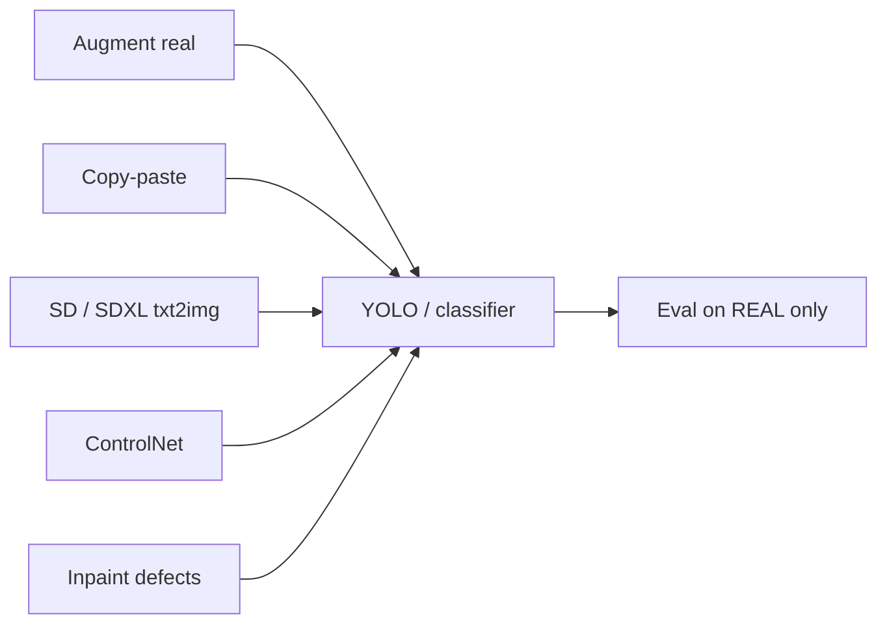

# Synthetic Image Generation

**Prev:** [[04 - Detection and Segmentation]] · **Next:** [[06 - ONNX and TensorRT]]

---

## In plain English

Real-world CV datasets are **expensive** (label, collect, privacy). **Synthetic data** = images created by rules, simulation, or generative models so you control **labels for free**. This note is **example-heavy**: augment → composite → **generate images** with diffusion.

**Trap:** domain gap — synthetic ≠ real until you **validate on real** holdout.

---

## Pipeline map



---

## Example 1 — Albumentations (bbox-safe augment)

```python
import cv2
import albumentations as A
from albumentations.pytorch import ToTensorV2

img = cv2.imread("field.jpg")  # BGR
# YOLO format: class, x_center, y_center, w, h (normalized 0–1)
boxes = [[0, 0.5, 0.5, 0.2, 0.15]]
labels = [0]

transform = A.Compose([
    A.HorizontalFlip(p=0.5),
    A.RandomBrightnessContrast(brightness_limit=0.2, contrast_limit=0.2, p=0.7),
    A.Rotate(limit=20, p=0.5, border_mode=cv2.BORDER_REFLECT_101),
    A.GaussNoise(var_limit=(10, 50), p=0.3),
    A.Resize(640, 640),
], bbox_params=A.BboxParams(format="yolo", label_fields=["class_labels"]))

for i in range(10):
    out = transform(image=img, bboxes=boxes, class_labels=labels)
    aug_img = out["image"]
    aug_boxes = out["bboxes"]
    cv2.imwrite(f"aug_{i}.jpg", aug_img)
    # write matching label file aug_i.txt
```

| Input | Output |
|-------|--------|
| 1 image + boxes | New image + **transformed** boxes |

**Resources:** [albumentations.ai](https://albumentations.ai/) · [docs](https://albumentations.ai/docs/)

---

## Example 2 — torchvision v2 (classification)

```python
import torch
from torchvision import transforms

train_tf = transforms.Compose([
    transforms.RandomResizedCrop(224, scale=(0.8, 1.0)),
    transforms.RandomHorizontalFlip(),
    transforms.ColorJitter(brightness=0.2, contrast=0.2, saturation=0.1),
    transforms.ToTensor(),
    transforms.Normalize(mean=[0.485, 0.456, 0.406], std=[0.229, 0.224, 0.225]),
])
```

---

## Example 3 — Copy-paste object (full OpenCV)

```python
import cv2
import numpy as np
import random

def paste_rgba(fg_bgra, bg_bgr, x, y):
    """Paste BGRA foreground onto BGR background at top-left (x, y)."""
    fh, fw = fg_bgra.shape[:2]
    bh, bw = bg_bgr.shape[:2]
    x2, y2 = min(x + fw, bw), min(y + fh, bh)
    w, h = x2 - x, y2 - y
    fg = fg_bgra[:h, :w]
    alpha = fg[:, :, 3:4] / 255.0
    rgb = fg[:, :, :3]
    roi = bg_bgr[y:y2, x:x2]
    blended = (alpha * rgb + (1 - alpha) * roi).astype(np.uint8)
    bg_bgr[y:y2, x:x2] = blended
    return bg_bgr, (x, y, x2, y2)  # bbox xyxy for label

bg = cv2.imread("background.jpg")
fg = cv2.imread("weed_crop.png", cv2.IMREAD_UNCHANGED)
x, y = random.randint(0, bg.shape[1] - 100), random.randint(0, bg.shape[0] - 100)
bg, (x1, y1, x2, y2) = paste_rgba(fg, bg, x, y)
cv2.imwrite("synthetic_compose.jpg", bg)
```

**With SAM:** segment object first → export PNG with alpha → paste.

**Resources:** [SAM 2](https://github.com/facebookresearch/segment-anything-2) · [Roboflow copy-paste](https://blog.roboflow.com/how-to-use-copy-paste-augmentations/)

---

## Example 4 — YOLO training with built-in augment (Mosaic)

```python
from ultralytics import YOLO

model = YOLO("yolov8n.pt")
model.train(
    data="dataset.yaml",   # train/val paths, class names
    epochs=50,
    imgsz=640,
    mosaic=1.0,            # 4-image mosaic
    mixup=0.1,
    hsv_h=0.015, hsv_s=0.7, hsv_v=0.4,
)
# Predict on real holdout only for honest metrics
metrics = model.val(data="dataset.yaml", split="val")
```

`dataset.yaml` example:

```yaml
path: /data/weeds
train: images/train
val: images/val
names:
  0: weed
  1: crop
```

**Resources:** [Ultralytics docs](https://docs.ultralytics.com/)

---

## Example 5 — Text-to-image (Stable Diffusion, diffusers)

Generate **new scenes** from prompts (no real photo needed).

```python
import torch
from diffusers import StableDiffusionPipeline

pipe = StableDiffusionPipeline.from_pretrained(
    "runwayml/stable-diffusion-v1-5",
    torch_dtype=torch.float16,
    safety_checker=None,  # disable only in trusted offline sandboxes
)
pipe = pipe.to("cuda")

prompts = [
    "aerial photo of wheat field, overcast, Switzerland, 4k",
    "close-up rust defect on steel plate, industrial lighting",
    "empty warehouse floor, high resolution, security camera angle",
]

for i, p in enumerate(prompts):
    image = pipe(
        prompt=p,
        negative_prompt="blurry, cartoon, watermark, text",
        num_inference_steps=30,
        guidance_scale=7.5,
        generator=torch.Generator("cuda").manual_seed(42 + i),
    ).images[0]
    image.save(f"generated_{i:03d}.png")
```

| Parameter | Effect |
|-----------|--------|
| `guidance_scale` | Higher → stricter prompt (typical 5–9) |
| `num_inference_steps` | More steps → sharper, slower |
| `negative_prompt` | What to avoid |

**SDXL (higher quality):**

```python
from diffusers import DiffusionPipeline

pipe = DiffusionPipeline.from_pretrained(
    "stabilityai/stable-diffusion-xl-base-1.0",
    torch_dtype=torch.float16,
    use_safetensors=True,
    variant="fp16",
).to("cuda")
image = pipe("drone view of vineyard rows at dusk").images[0]
```

**Resources:** [Hugging Face diffusers](https://huggingface.co/docs/diffusers) · [SDXL model card](https://huggingface.co/stabilityai/stable-diffusion-xl-base-1.0)

---

## Example 6 — ControlNet (layout-controlled generation)

Use a **real** edge map or depth map so generated images match structure.
![[Pasted image 20260525165001.png]]
```python
import cv2
import torch
import numpy as np
from diffusers import StableDiffusionControlNetPipeline, ControlNetModel

# 1) Build control image (Canny)
img = cv2.imread("reference_field.jpg")
gray = cv2.cvtColor(img, cv2.COLOR_BGR2GRAY)
canny = cv2.Canny(gray, 100, 200)
canny_rgb = cv2.cvtColor(canny, cv2.COLOR_GRAY2RGB)
cv2.imwrite("control_canny.png", canny_rgb)

# 2) Generate
controlnet = ControlNetModel.from_pretrained(
    "lllyasviel/sd-controlnet-canny", torch_dtype=torch.float16
)
pipe = StableDiffusionControlNetPipeline.from_pretrained(
    "runwayml/stable-diffusion-v1-5",
    controlnet=controlnet,
    torch_dtype=torch.float16,
).to("cuda")

out = pipe(
    prompt="agricultural field with young corn plants, drone view, realistic",
    image=canny_rgb,
    num_inference_steps=30,
).images[0]
out.save("generated_controlnet.png")
```

| Control | Model ID | Best for |
|---------|----------|----------|
| Canny edges | `sd-controlnet-canny` | Layout from [[01 - OpenCV Fundamentals]] |
| Depth | `sd-controlnet-depth` | MiDaS depth on reference |
| Seg map | `sd-controlnet-seg` | Color-coded regions |

---

## Example 7 — Inpainting (add defects / change regions)
![[Pasted image 20260525165025.png]]
```python
import torch
from PIL import Image
from diffusers import StableDiffusionInpaintPipeline

pipe = StableDiffusionInpaintPipeline.from_pretrained(
    "runwayml/stable-diffusion-inpainting",
    torch_dtype=torch.float16,
).to("cuda")

image = Image.open("metal_plate.jpg").convert("RGB")
# White = inpaint region (draw in GIMP or OpenCV)
mask = Image.open("mask_scratch.png").convert("L")

result = pipe(
    prompt="deep scratch defect on metal surface",
    negative_prompt="blurry, unrealistic",
    image=image,
    mask_image=mask,
    num_inference_steps=40,
).images[0]
result.save("metal_with_synthetic_defect.jpg")
```

**Create mask in OpenCV:**

```python
import cv2
import numpy as np

img = cv2.imread("metal_plate.jpg")
mask = np.zeros(img.shape[:2], dtype=np.uint8)
cv2.rectangle(mask, (200, 150), (350, 220), 255, -1)
cv2.imwrite("mask_scratch.png", mask)
```

---

## Example 8 — Batch synthetic dataset on disk

Standard layout for training:

```
dataset/
  images/train/
    syn_0001.jpg
    syn_0002.jpg
  labels/train/
    syn_0001.txt    # YOLO: class xc yc w h
  images/val/       # REAL images only for honest eval
```

```python
from pathlib import Path

out_dir = Path("dataset/images/train")
out_dir.mkdir(parents=True, exist_ok=True)

for i in range(100):
    img = pipe(prompt="...", generator=torch.Generator("cuda").manual_seed(i)).images[0]
    img.save(out_dir / f"syn_{i:04d}.jpg")
    # optional: auto-label with pretrained detector + human QA sample
```

**QA rule:** manually review **5–10%** of synthetic images before training.

---

## Example 9 — API image generation (OpenAI)

```python
# pip install openai
from openai import OpenAI

client = OpenAI()
resp = client.images.generate(
    model="gpt-image-1",  # or dall-e-3 per current API docs
    prompt="top-down photo of herbicide damage on soybean leaves",
    size="1024x1024",
    n=1,
)
# save b64 or URL from resp — check official docs for response shape
```

**Resources:** [OpenAI image generation docs](https://platform.openai.com/docs/guides/image-generation)

---

## Simulation tier (3D → labels)

| Engine | Link |
|--------|------|
| CARLA | [carla.org](https://carla.org/) |
| BlenderProc | [github.com/DLR-RM/BlenderProc](https://github.com/DLR-RM/BlenderProc) |
| Isaac Sim | [developer.nvidia.com/isaac/sim](https://developer.nvidia.com/isaac-sim) |

```python
# BlenderProc (illustrative — install blenderproc first)
import blenderproc as bproc
# load objects, sample camera, render RGB + instance seg + bbox COCO
# bproc.writer.write_coco_annotations(...)
```

---

## End-to-end workflow (defect detection)

| Step | Action | Example # |
|------|--------|-----------|
| 1 | 200 real defect photos | — |
| 2 | Albumentations ×10 | Ex 1 |
| 3 | Copy-paste weeds on new fields | Ex 3 |
| 4 | SD inpaint 300 scratch defects | Ex 7 |
| 5 | ControlNet 200 layout-matched fields | Ex 6 |
| 6 | Train YOLO | Ex 4 |
| 7 | **mAP on real val only** | Ex 4 `model.val` |

---

## Tool & resource index

| Need | Tool | URL |
|------|------|-----|
| Augment + bbox | Albumentations | [albumentations.ai](https://albumentations.ai/) |
| Train detector | Ultralytics YOLO | [docs.ultralytics.com](https://docs.ultralytics.com/) |
| Txt2img / inpaint | Hugging Face diffusers | [huggingface.co/docs/diffusers](https://huggingface.co/docs/diffusers) |
| ControlNet | lllyasviel repo | [github.com/lllyasviel/ControlNet](https://github.com/lllyasviel/ControlNet) |
| Segment for paste | SAM 2 | [github.com/facebookresearch/segment-anything-2](https://github.com/facebookresearch/segment-anything-2) |
| Datasets hub | HF Datasets | [huggingface.co/datasets](https://huggingface.co/datasets) |
| Roboflow | labeling + export | [roboflow.com](https://roboflow.com/) |

---

## Interview one-liner

> "I scale real labels with Albumentations and copy-paste, generate diversity with SD/ControlNet/inpainting, store images in YOLO layout, and always report metrics on a real validation set."

---

## Common traps

| Trap | Correct |
|------|---------|
| Train & test only on synthetic | **Real** holdout mandatory |
| No human QA on diffusion | Spot-check 5–10% |
| Wrong bbox after augment | Use **bbox_params** in Albumentations |
| Huge files in Git | Store in S3 / DVC; Git keeps manifests |

---

**Next:** [[06 - ONNX and TensorRT]]
