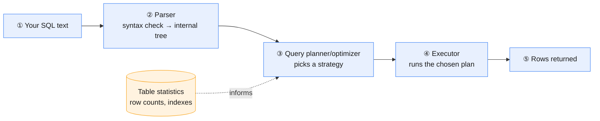

# SQL from Scratch: How a Query Executes

**Prev:** [[08 - SQL Cheatsheet]] · **Next:** [[08.2 - SQL Indexes and Query Execution Plans]]

---

## Interview one-liner

SQL is **declarative** — you describe the *shape* of the answer you want ("departments with average salary above X"), not the steps to compute it. The database's query planner decides the steps. That single fact is why the same query can run in 2ms or 20 seconds depending entirely on things you never wrote in the query — indexes, statistics, table size.

---

## In plain English

Every other language you've likely written (Python, JavaScript) is **imperative**: you say exactly what to do, in order — loop over this, check that, append there. SQL is the opposite. You write `SELECT dept FROM employees WHERE salary > 100000`, and you never say *how* to find those rows — no "loop through each row," no "check this index first." The database figures that part out. This note is about what actually happens between you hitting "run" and getting rows back.

---

## The relational model (assume nothing)

| Term | What it actually is | Example |
|------|------------------------|-----------|
| **Table** | A named collection of rows, all with the same columns | `employees` |
| **Row (tuple)** | One record | One employee |
| **Column (attribute)** | One named, typed field on every row | `salary`, type `NUMERIC` |
| **Primary key** | The column(s) that uniquely identify a row — the database enforces no two rows share one | `employee_id` |
| **Foreign key** | A column that points to another table's primary key, enforcing that the reference actually exists | `orders.user_id → users.id` |
| **Schema** | The definition of tables, columns, types, and constraints — the "shape" of the database | `CREATE TABLE employees (id INT PRIMARY KEY, name TEXT, salary NUMERIC)` |

A **relational** database is built entirely around tables connected by these keys — "relational" refers to the mathematical relations (tables), not to the fact that tables relate to each other, though that's the practical effect.

---

## From SQL text to rows: the execution pipeline

**① Your SQL text.** The query as you wrote it — just a string, so far.

**② Parser.** Checks the SQL is syntactically valid and turns it into an internal tree structure the database can reason about. This is also where a typo (`SELCT`) gets caught, before any table is even touched.

**③ Query planner / optimizer.** The most important, least visible step. The planner looks at **table statistics** — row counts, value distributions, which indexes exist — and decides *how* to actually get the answer: scan the whole table, or use an index? Join these two tables in which order? This decision is why identical-looking queries can have wildly different speeds on different databases, or on the same database as the data grows — full depth in [[08.2 - SQL Indexes and Query Execution Plans]].

**④ Executor.** Carries out the plan the optimizer chose — the actual disk reads, comparisons, and joins happen here.

**⑤ Rows returned.** The result set, sent back to you.

---

## The order you write vs the order it actually runs

This is one of the most common SQL interview questions, and it trips people up because the **written** order and the **logical evaluation** order are different:

| Written order | Logical evaluation order |
|-------------------|------------------------------|
| `SELECT` | 1. `FROM` (+ `JOIN`) |
| `FROM` | 2. `WHERE` |
| `WHERE` | 3. `GROUP BY` |
| `GROUP BY` | 4. `HAVING` |
| `HAVING` | 5. `SELECT` |
| `ORDER BY` | 6. `ORDER BY` |
| `LIMIT` | 7. `LIMIT` |

This is *exactly* why `WHERE` can't reference an aggregate (`WHERE AVG(salary) > X` fails) but `HAVING` can — logically, `WHERE` runs **before** aggregation even happens, and `HAVING` runs **after**. It's also why you can't reference a `SELECT` alias inside `WHERE` in most databases — `SELECT` hasn't logically run yet when `WHERE` is evaluated.

---

## Common traps

| Trap | Why it's wrong | What to say instead |
|------|------------------|----------------------|
| Assuming SQL runs top-to-bottom like Python | The written order and the logical evaluation order are different — see the table above | "I'd reason about `FROM → WHERE → GROUP BY → HAVING → SELECT → ORDER BY` regardless of how it's written" |
| Assuming the same query is always equally fast | The planner's decision depends on live table statistics — a query that's fast on 1,000 rows can pick a completely different (slower) plan at 10 million rows | "I'd check the execution plan rather than assume performance transfers across data sizes" |
| Thinking SQL syntax is standardized everywhere | Core SQL is standardized (ANSI SQL), but window functions, JSON handling, and syntax details vary by engine | "I'd double check engine-specific behavior — see [[08.4 - SQL Database Engines Compared]]" |
| Using a `SELECT` column alias inside the same query's `WHERE` clause | `WHERE` is evaluated before `SELECT`, logically — the alias doesn't exist yet at that point | "I'd repeat the expression in `WHERE`, or wrap the query in a CTE and filter in the outer query" |

---

**Next:** [[08.2 - SQL Indexes and Query Execution Plans]]
