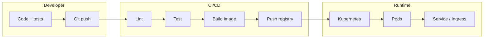

# Chapter 16 — DevOps, CI/CD & Kubernetes

**What this chapter is:** how code moves from **commit → tested artifact → running service** in production. Organized for data/ML engineers who ship models and APIs, not only pure SRE roles.

**Overview = story only.** Detail notes hold concepts, YAML patterns, traps, and interview lines.

**Prerequisite:** [[13 Software Engineering & Python/02 - Git Essentials]] · [[13 Software Engineering & Python/04 - APIs FastAPI and Flask]]

---

## The story (production path)

1. **DevOps mindset** — culture + automation goals ([[01 - DevOps Mindset]])
2. **CI vs CD** — integration, delivery, deployment ([[02 - CI CD Concepts]])
3. **Pipeline stages** — lint → test → build → deploy ([[03 - Pipeline Stages]])
4. **CI in practice** — GitHub Actions / GitLab patterns ([[04 - CI CD in Practice]])
5. **Docker** — image, container, why K8s needs it ([[05 - Docker and Containers]])
6. **Kubernetes architecture** — control plane, nodes, etcd ([[06 - Kubernetes Architecture]])
7. **K8s workloads** — Pod, Deployment, Service, Ingress ([[07 - Kubernetes Workloads]])
8. **Config, ops & ML deploy** — Secrets, probes, model serving ([[08 - Kubernetes Ops and ML Deploy]])

---
Service Mapping Matrix

Most core services are highly comparable in terms of underlying capability, differing primarily in their interface and specific configuration options. [[1](https://www.youtube.com/watch?v=hI8PVJBpHTY&t=104), [2](https://www.youtube.com/watch?v=C2YXHlegJ38&t=73)]

| Category                  | AWS Service                                           | Azure Service                                                                      | Google Cloud Service                                     |
| ------------------------- | ----------------------------------------------------- | ---------------------------------------------------------------------------------- | -------------------------------------------------------- |
| **Virtual Servers**       | [Amazon EC2](https://aws.amazon.com/ec2/)             | [Azure Virtual Machines](https://azure.microsoft.com/services/virtual-machines/)   | [Compute Engine](https://cloud.google.com/compute)       |
| **Object Storage**        | [Amazon S3](https://aws.amazon.com/s3/)               | [Azure Blob Storage](https://azure.microsoft.com/services/storage/blobs/)          | [Cloud Storage](https://cloud.google.com/storage)        |
| **Managed Kubernetes**    | [Amazon EKS](https://aws.amazon.com/eks/)             | [Azure AKS](https://azure.microsoft.com/services/kubernetes-service/)              | [Google GKE](https://cloud.google.com/kubernetes-engine) |
| **Serverless Compute**    | [AWS Lambda](https://aws.amazon.com/lambda/)          | [Azure Functions](https://azure.microsoft.com/services/functions/)                 | [Cloud Run](https://cloud.google.com/run) / Functions    |
| **Relational Database**   | [Amazon RDS](https://aws.amazon.com/rds/)             | [Azure SQL Database](https://azure.microsoft.com/products/azure-sql/database/)     | [Cloud SQL](https://cloud.google.com/sql)                |
| **NoSQL Database**        | [Amazon DynamoDB](https://aws.amazon.com/dynamodb/)   | [Azure Cosmos DB](https://azure.microsoft.com/services/cosmos-db/)                 | [Cloud Firestore](https://cloud.google.com/firestore)    |
| **Data Warehouse**        | [Amazon Redshift](https://aws.amazon.com/redshift/)   | [Azure Synapse Analytics](https://azure.microsoft.com/services/synapse-analytics/) | [Google BigQuery](https://cloud.google.com/bigquery)     |
| **AI / Machine Learning** | [Amazon SageMaker](https://aws.amazon.com/sagemaker/) | [Azure AI Services](https://azure.microsoft.com/solutions/ai/)                     | [Vertex AI](https://cloud.google.com/vertex-ai)          |
## Big picture (one diagram)

---

## Reading path

| # | Topic | Note |
|---|--------|------|
| 1 | DevOps mindset | [[01 - DevOps Mindset]] |
| 2 | CI/CD concepts | [[02 - CI CD Concepts]] |
| 3 | Pipeline stages | [[03 - Pipeline Stages]] |
| 4 | CI/CD in practice | [[04 - CI CD in Practice]] |
| 5 | Docker & containers | [[05 - Docker and Containers]] |
| 6 | K8s architecture | [[06 - Kubernetes Architecture]] |
| 7 | K8s workloads | [[07 - Kubernetes Workloads]] |
| 8 | Ops & ML on K8s | [[08 - Kubernetes Ops and ML Deploy]] |

---

## CI/CD vs Kubernetes (one table)

| | CI/CD pipeline | Kubernetes |
|---|----------------|--------------|
| **When** | On every commit / release | Always running |
| **Job** | Build, test, publish artifact | Schedule containers, heal, scale |
| **Output** | Image in registry, passing tests | Pods serving traffic |
| **Tool examples** | GitHub Actions, GitLab CI | `kubectl`, Helm, Argo CD |

---

## SOTA & trends (2024–2026)

| Trend | Note |
|-------|------|
| **GitOps** | Git = source of truth; Argo CD / Flux sync cluster |
| **OIDC to cloud** | CI pipelines assume roles without long-lived keys |
| **ML platforms** | Kubeflow, KServe, BentoML on K8s |
| **Serverless GPUs** | Some teams skip K8s for batch; K8s still default for APIs |

---

## Common traps (chapter)

| Trap | Correct |
|------|---------|
| "CI = deploy to prod" | CI = **integrate**; CD = **deliver/deploy** (definitions vary by team) |
| "Kubernetes = Docker" | K8s **orchestrates** containers; Docker **builds/runs** them |
| No health checks | **Liveness** vs **readiness** probes |
| Latest tag in prod | Pin **image digest** or semver tag |
| Secrets in Git | Use **Secrets** / vault / CI secret store |

---

**Prev:** [[13 Software Engineering & Python/14 C++ for Data Science & Engineering/00 - Chapter Overview]] · **Next:** [[15 Interview & Career/00 - Chapter Overview]]

[[Home|← Home]]
