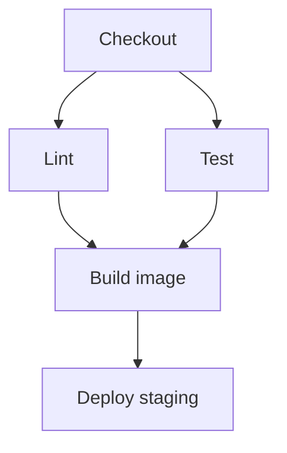

# Pipeline Stages

**Prev:** [[02 - CI CD Concepts]] · **Next:** [[04 - CI CD in Practice]]

---

## In plain English

A **pipeline** is an ordered checklist that runs on every change. Think **assembly line**: each stage has clear **inputs** and **outputs**.

---

## Standard stage order

| # | Stage | Input | Output | Fails if |
|---|-------|-------|--------|----------|
| 1 | **Checkout** | repo URL, branch | working tree | clone error |
| 2 | **Lint / format** | source | pass/fail | style, types (ruff, mypy) |
| 3 | **Unit tests** | code + deps | test report | assertion fail |
| 4 | **Build** | Dockerfile / setup | image or package | compile error |
| 5 | **Integration tests** | image + test DB | pass/fail | API contract break |
| 6 | **Security scan** | image/deps | CVE report | critical vuln (policy) |
| 7 | **Publish** | image | tag in registry | push auth fail |
| 8 | **Deploy** | image tag + manifest | rollout in cluster | health check fail |

Not every repo needs all 8 — **ML API** might skip heavy integration; **library** might skip deploy.

---

## ML-specific stages (add when relevant)

| Stage | What it checks |
|-------|----------------|
| **Data/schema tests** | Great Expectations, dbt tests |
| **Model eval** | accuracy/F1 vs baseline on holdout |
| **Bias / fairness** | optional gate for regulated domains |
| **Smoke inference** | load model, one batch predict |

---

## Gates & quality

| Gate | Blocks deploy when |
|------|-------------------|
| Test coverage threshold | Coverage drops below X% |
| Sonar / code quality | New critical issues |
| Manual approval | Prod deploy (CD delivery mode) |
| Canary metrics | Error rate ↑ after 5% traffic |

---

## Parallel vs sequential

**Parallelize** lint + unit tests to save minutes.

---

## Rollback

| Strategy | How |
|----------|-----|
| **Redeploy previous image tag** | Fastest on K8s (`kubectl rollout undo`) |
| **Git revert** | New commit triggers pipeline |
| **Feature flag** | Disable bad model without redeploy |

---

## Interview one-liner

> "Pipeline stages flow checkout → static checks → tests → immutable artifact → optional security scan → deploy with health gates; ML adds eval and inference smoke tests."

---

**Next:** [[04 - CI CD in Practice]]
