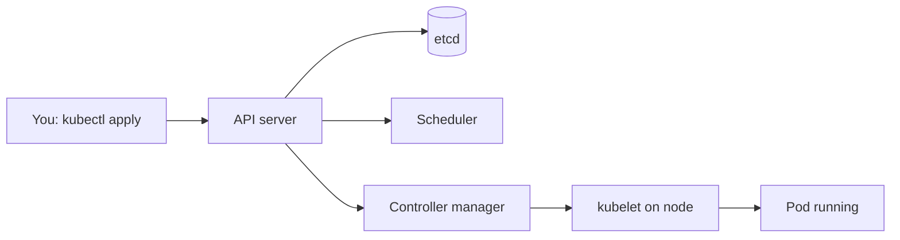
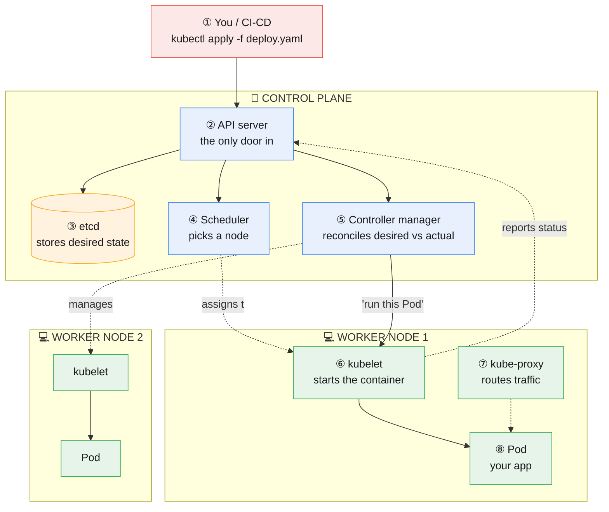

# Kubernetes Architecture

**Prev:** [[05 - Docker and Containers]] · **Next:** [[07 - Kubernetes Workloads]]

---

## The idea, in one sentence

Kubernetes is a program that constantly compares **"what you asked for"** (e.g. "I want 3 copies of my app running") against **"what's actually running right now,"** and automatically takes action to close the gap — restarting crashed containers, moving work off a dead machine, adding more copies under load. You never tell it *how* to do that step by step; you just declare the end state you want, and it keeps enforcing it forever.

---

## Legend

🔵 You / user &nbsp;·&nbsp; 🟦 Control plane (the "brain") &nbsp;·&nbsp; 🟢 Worker node &nbsp;·&nbsp; 🟠 Stored state

---

## Quick overview

| Block | In one sentence |
|-------|-------------------|
| **You: kubectl apply** | You declare the end state you want, in YAML — never the steps to get there. |
| **API server** | The single front door — every other piece only ever talks to Kubernetes through here. |
| **etcd** | Durably stores that desired state — the cluster's single source of truth. |
| **Scheduler** | Picks which machine a new Pod should run on, based on free capacity. |
| **Controller manager** | Constantly compares desired vs actual state and corrects any gap — this is "self-healing." |
| **kubelet on node** | The agent on each machine that actually starts/stops containers and reports status back. |
| **Pod running** | Your real, running container(s) — the thing the whole system exists to keep alive. |

---

## Detailed diagram

---

## Step-by-step walkthrough

**① You.** A person running `kubectl apply -f deploy.yaml`, or more commonly in a real company, a CI/CD pipeline doing this automatically after a successful build. The YAML file describes the **desired state**: "I want 3 replicas of image `my-api:v2`, each needing 500m CPU."

**② API server.** The single front door to the entire cluster — literally every other component, and every human, only ever talks to Kubernetes through this one component. It validates your YAML, and either saves new desired state or answers questions about current state. Nothing in Kubernetes bypasses this. **Example:** running `kubectl get pods` also just sends a request here.

**③ etcd.** A simple, fast key-value database (not a general SQL database) whose only job is to durably store the cluster's desired state. If etcd is lost, the cluster forgets everything it was supposed to be running. It's the **source of truth** — everything else is just working to make reality match what's written here.

**④ Scheduler.** Whenever a new Pod needs to run somewhere but hasn't been assigned to a specific machine yet, the scheduler looks at all worker nodes, checks which ones have enough free CPU/memory (and satisfy any other rules you set, like "must run on a GPU node"), and picks one. It only *decides* — it doesn't actually start anything itself.

**⑤ Controller manager.** Runs many small, independent loops, each responsible for one type of resource (Deployments, ReplicaSets, Jobs, etc.), and each loop does the same thing forever: *look at desired state, look at actual state, if they differ, take an action to fix it.* This is the actual mechanism behind "self-healing" — if a Pod crashes, the ReplicaSet controller notices actual (2 Pods) no longer matches desired (3 Pods) and creates a replacement.

**⑥ kubelet.** An agent that runs on every single worker machine. It's the only component that actually talks to the container runtime to start/stop containers. It constantly reports back to the API server: "here's what's actually running on my machine right now" — this report is what the controller manager compares against desired state.

**⑦ kube-proxy.** Also runs on every worker machine. Its job is networking: when traffic needs to reach a Pod (which can be recreated at a different internal IP address at any time), kube-proxy maintains the rules that route traffic to whichever Pod is currently alive and correctly labeled — this is what makes a **Service** (a stable network name) work even though the Pods behind it come and go.

**⑧ Pod.** The actual unit that runs your code — one or more containers that are always scheduled and scaled together as a single group (e.g. your app container plus a logging sidecar container that ships its logs somewhere). This is what the whole system exists to run.

---

## Two things people confuse

| Term | What it actually is | Common confusion |
|------|------------------------|----------------------|
| **Container** | A single packaged process (e.g. your API's Docker image, running) | People say "container" when they mean "Pod" |
| **Pod** | Kubernetes's actual unit of scheduling — a group of one or more containers that always run together, on the same machine, sharing network/storage | A Pod usually has just one container, but can have more (e.g. app + sidecar) |

---

## The desired-state model, with a concrete walk-through

| You declare in YAML | What the controller manager actually does about it |
|-----------------------|--------------------------------------------------------|
| `replicas: 3` | If only 2 Pods are running (one crashed), it creates a 3rd. If 4 are somehow running, it deletes one |
| `image: my-api:v2` | If Pods are still running `v1`, it gradually replaces them with `v2` (a **rolling update** — old ones stay up until new ones are healthy, so users never see downtime) |
| `resources: cpu: 500m` | The scheduler only places this Pod on a node that actually has 500m of CPU free |

This is the core idea of "**declarative**, not imperative": you never write "start a container, then another, then check if they're healthy" — you just declare the end state, and the system figures out and continuously re-does whatever steps are needed to keep it that way, even hours or days later if something changes.

---

## Namespaces — how one cluster is shared safely

| Namespace | Typical use | Real example |
|-----------|---------------|----------------|
| `default` | Fine for small teams / experiments | A solo developer's test cluster |
| `staging` / `production` | Keeps environments from ever mixing | Deploying to `staging` can never accidentally affect real user traffic in `production` |
| `kube-system` | Kubernetes's own internal components live here | You'll see the API server, DNS, etc. running as Pods in this namespace |

Access rules (**RBAC** — Role-Based Access Control) can be set per namespace, so, e.g., the frontend team can be given permission to deploy into `staging` but not `production`.

---

## kubectl — the commands you'll actually use, and what they touch

| Command | What it's really doing | Plain explanation |
|---------|---------------------------|----------------------|
| `kubectl apply -f deploy.yaml` | Writes new **desired state** to the API server (→ etcd) | "Here's what I want running" |
| `kubectl get pods` | Reads **actual state** from the API server | "What's actually running right now?" |
| `kubectl describe pod x` | Reads detailed status + recent events for one Pod | "Why is this Pod stuck pending / crashing?" |
| `kubectl logs pod x` | Streams that Pod's container's stdout/stderr | "What is this container actually printing?" |

---

## Managed Kubernetes — what the cloud provider does for you

| Service | Provider | What you still manage yourself |
|---------|----------|-----------------------------------|
| EKS | AWS | Worker nodes and what runs on them |
| GKE | Google Cloud | Worker nodes and what runs on them |
| AKS | Azure | Worker nodes and what runs on them |

In all three, the **control plane** (API server, etcd, scheduler, controller manager) is run and kept highly-available for you by the cloud provider — you only manage the worker nodes and the workloads (Pods) you deploy onto them.

---

## Common traps

| Trap | Why it's wrong | What to say instead |
|------|------------------|----------------------|
| "Kubernetes runs my containers directly" | It never talks to containers directly — the kubelet does, on the API server's instruction | "The API server updates desired state, the controller manager notices the gap, and the kubelet on the target node actually starts the container" |
| Thinking a Pod = a container, always | A Pod can hold multiple containers that must run together | "A Pod is the group; most have one container, but sidecars are a common exception" |
| Assuming `kubectl apply` deploys instantly and directly | It only writes desired state — the actual rollout happens gradually and asynchronously, driven by controllers | "It's declarative — apply just states intent, controllers do the actual work over the following seconds" |
| Forgetting that `kube-proxy` is what makes Services work at all | Without it, traffic to a Service's stable name wouldn't know which ever-changing Pod IP to reach | "Services are a stable name; kube-proxy is the mechanism that keeps routing to whichever Pods are currently alive" |

---

## Interview one-liner

> "The API server is the only entry point, and etcd stores the desired state it's given. The scheduler assigns new Pods to a node with enough capacity, and the controller manager constantly runs reconciliation loops comparing desired vs actual state — that's the actual mechanism behind self-healing and rolling updates. On each node, the kubelet is what starts containers and reports status back, and kube-proxy keeps network routing correct as Pods come and go."

---

**Next:** [[07 - Kubernetes Workloads]]
