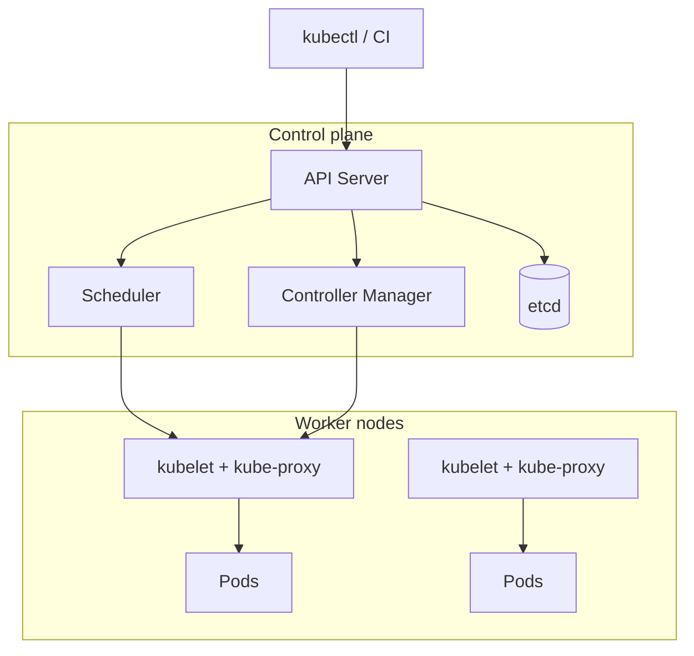

# Kubernetes Architecture

**Prev:** [[05 - Docker and Containers]] · **Next:** [[07 - Kubernetes Workloads]]

---

## In plain English

**Kubernetes (K8s)** is a **cluster operating system** for containers: schedules workloads, restarts failures, scales replicas, exposes network, rolls out updates.

---

## Cluster map (most important pieces)

---

## Control plane components

| Component | Input | Output | Role |
|-----------|-------|--------|------|
| **API server** | `kubectl`, controllers | REST responses | Front door; all changes go here |
| **etcd** | writes from API | stored cluster state | Source of truth (desired state) |
| **Scheduler** | unscheduled Pod | Pod → Node assignment | Picks node with resources |
| **Controller manager** | desired vs actual | reconcile loops | Deployments, ReplicaSets, etc. |

---

## Worker node components

| Component | Role |
|-----------|------|
| **kubelet** | Agent — ensures containers in Pod spec are running |
| **kube-proxy** | Network rules for **Service** load balancing |
| **Container runtime** | containerd / CRI-O — actually runs images |

---

## Desired state model

| You declare (YAML) | Controllers ensure |
|--------------------|-------------------|
| `replicas: 3` | Always 3 Pods running |
| `image: my-api:v2` | Rolling update to v2 |
| `cpu: 500m` | Scheduler places on fitting node |

**Declarative:** you say **what** you want; K8s figures **how**.

---

## Namespaces

| Namespace | Typical use |
|-----------|-------------|
| `default` | Small teams |
| `staging` / `prod` | Environment isolation |
| `kube-system` | K8s internals |

RBAC limits who can change what per namespace.

---

## kubectl mental model

| Command | Reads/writes |
|---------|--------------|
| `kubectl apply -f deploy.yaml` | desired state → API |
| `kubectl get pods` | actual state ← API |
| `kubectl describe pod x` | events, why pending |
| `kubectl logs pod x` | container stdout |

---

## Managed K8s (cloud)

| Service | Provider |
|---------|----------|
| EKS | AWS |
| GKE | Google |
| AKS | Azure |

Control plane managed; you manage node pools / workloads.

---

## Interview one-liner

> "The API server fronts etcd's cluster state; the scheduler places Pods on nodes; controllers reconcile desired vs actual; kubelets run containers — CI publishes images, manifests tell K8s which image to run."

---

**Next:** [[07 - Kubernetes Workloads]]
