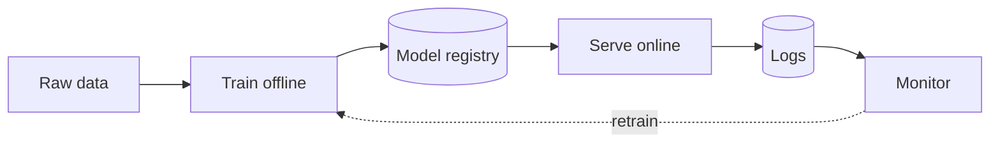
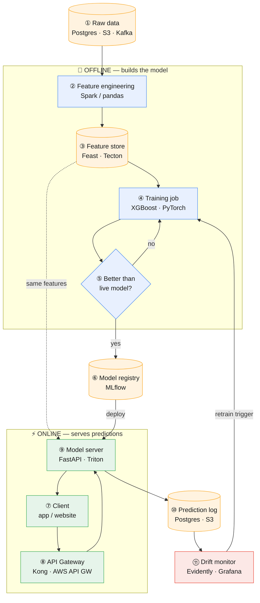

# ML System Architecture

**Prev:** [[00 - Chapter Overview]] · **Next:** [[02 - LLM and RAG Architecture]]

---

## The idea, in one sentence

A machine learning system in production is really **two separate pipelines that share the same features**: one that **trains** the model offline (slow, runs on a schedule), and one that **serves** predictions online (fast, runs on every request) — plus a **feedback loop** that watches the live model and tells the training pipeline when it's time to retrain.

If you only remember one thing: **training and serving must compute features the exact same way**, or the model behaves differently in production than it did in your tests. This is the #1 real-world bug in ML systems, and it's called **training/serving skew**.

---

## Legend

🔵 Offline (batch, scheduled) &nbsp;·&nbsp; 🟢 Online (real-time, per-request) &nbsp;·&nbsp; 🟠 Data store &nbsp;·&nbsp; 🔴 Monitoring / feedback

---

## Quick overview

The shape to remember, with no detail yet — two loops sharing one thing (the features), plus a loop that closes back to training:

| Block | In one sentence |
|-------|-------------------|
| **Raw data** | Everything the company already has — production DB rows, events, logs. |
| **Train offline** | A scheduled job turns that raw data into a model, on its own time, not blocking any user. |
| **Model registry** | The approved model gets saved with a version number, so it can be deployed or rolled back. |
| **Serve online** | The live model answers real user requests, fast, one prediction at a time. |
| **Logs** | Every prediction made online gets written down, so it can be checked later. |
| **Monitor** | Watches those logs for the model going stale, and tells "train offline" to run again. |

---

## Detailed diagram

Same shape, now with every step numbered and its real-world technology named right in the box — read the numbers in order; the full explanation of *why* each step exists is in the walkthrough below.

---

## Step-by-step walkthrough

**① Raw data.** Everything starts as data your company already has: rows in a production database, clickstream events, logs. **Example tech:** PostgreSQL, MongoDB, Kafka topics, S3 files.

**② Feature engineering.** Raw data isn't useful to a model directly — a "timestamp of last purchase" needs to become something like "days since last purchase." This step is a scheduled job that computes those transformations. **Example tech:** a Spark job, a Python script using pandas, or a scheduled dbt model.

**③ Feature store.** This is the piece people forget, and it's the one that prevents the #1 bug (training/serving skew). It's a database that stores the *definition* of each feature (e.g. "average order value in the last 30 days") and computes it consistently, so both the training job and the live model server ask it for the same number, computed the same way. **Example tech:** Feast (open source), Tecton, or Databricks Feature Store. Small teams sometimes skip this and just duplicate the code carefully — riskier, but common.

**④ Training job.** A script that takes historical features + historical outcomes (e.g. "did this user churn?") and fits a model to predict the outcome from the features. **Example tech:** scikit-learn, XGBoost, PyTorch — run on a schedule via Airflow or Kubeflow.

**⑤ Evaluate.** Before replacing the live model, you compare the new model's accuracy against the model currently in production, on a held-out test set. If it's not better, you don't ship it — you go back and improve the training step (more data, different features, tuning).

**⑥ Model registry.** Once a model passes evaluation, it's saved here with a version number, so you can deploy it, and roll back instantly if something goes wrong later. **Example tech:** MLflow Model Registry, SageMaker Model Registry.

**⑦ Client app.** Whatever is making the request — a mobile app checking "is this transaction fraud?", a website asking "what should I recommend this user?".

**⑧ API Gateway.** The single front door for all requests. It checks the caller is authenticated, makes sure no one is sending too many requests too fast (rate limiting), and forwards the request to the right internal service. **Example tech:** Kong, AWS API Gateway, or in a smaller system, just the routing layer of a FastAPI app.

**⑨ Model server.** The process that actually holds the model in memory and runs it against the incoming request to produce a prediction. **Example tech:** a FastAPI/Flask app wrapping the model, or a specialized high-performance server like NVIDIA Triton or AWS SageMaker endpoints.

**⑩ Prediction log.** Every single prediction the model makes gets written down: what data went in, what the model said. Without this, you have no way to check later whether the model was right, and no data to retrain on. **Example tech:** a simple table in Postgres, or files dropped into S3.

**⑪ Drift & performance monitor.** A process (often just a scheduled report) that compares the incoming data and the model's predictions against what it saw during training. If the real-world data has changed shape (**data drift**) or the model's accuracy has quietly dropped (**concept drift**), this is what catches it — and is what should trigger step ④ again. **Example tech:** Evidently AI, WhyLabs, or a custom dashboard built on Grafana + Prometheus.

---

## Two things people confuse

| Term | What it actually means | Example |
|------|--------------------------|---------|
| **Data drift** | The *input* data changed shape | Users started buying from a new country your model never saw prices from |
| **Concept drift** | The *relationship* between input and output changed | "Price > $500" used to mean luxury item; now it means normal electronics due to inflation |

---

## Batch vs real-time serving

| | Batch | Real-time (online) |
|---|-------|---------------------|
| **What it means** | Predictions computed ahead of time, for everyone, then just looked up when needed | Prediction computed fresh, the moment it's requested |
| **Latency you get** | Minutes to hours (doesn't matter, nobody's waiting) | Milliseconds (a user is waiting on screen) |
| **Real example** | Netflix computing "recommended for you" for all users overnight | A bank checking "is this specific card swipe fraud?" the instant it happens |
| **Typical tech** | Spark or Airflow job writing results into a database | A model server like FastAPI/Triton behind the API Gateway |
| **Cost** | Cheaper — big batch jobs use compute efficiently | More expensive — servers must stay on and respond fast 24/7 |

---

## Deploying a new model without breaking production

| Strategy | In plain words | Example |
|----------|------------------|---------|
| **Shadow deployment** | The new model runs in the background on real traffic, but its answers are only logged, never shown to users | Compare new fraud model vs old one for a week before trusting it |
| **Canary release** | The new model handles a small slice of real traffic (e.g. 5%), the rest still uses the old one | If error rate spikes on that 5%, you catch it before it affects everyone |
| **A/B test** | Traffic is split on purpose, and you measure a real business metric, not just accuracy | Does the new recommender actually increase purchases, not just "look more accurate" offline? |
| **Rollback** | Because of the model registry (⑥), reverting to the last known-good model is instant | A bad canary gets flagged, ops switches back to the previous version in seconds |

---

## Common traps

| Trap | Why it's wrong | What to say instead |
|------|------------------|----------------------|
| "My model got 95% accuracy offline, ship it" | Offline test data doesn't reflect live traffic — that's what shadow/canary deployment is for | "I'd validate with a shadow deployment before trusting the offline number" |
| Computing a feature one way in the training script and another way in the API code | This is training/serving skew — the model was trained on one definition of "recent purchases" and served with another | "That's exactly what a feature store prevents — one definition, used by both" |
| No prediction logging | You can't diagnose *why* a model is wrong, and you have no fresh data to retrain on | "Step ⑩ isn't optional — it's what makes step ④ (retraining) even possible" |
| Retraining blindly on a fixed schedule, no monitoring | You either retrain too often (wasteful) or too rarely (stale model) | "Retraining should be triggered by drift signals from monitoring, not just a calendar" |

---

## Interview one-liner

> "Offline, I turn raw data into versioned features — stored once in a feature store so training and serving read the exact same numbers — and train a model that only gets promoted to the registry if it beats the current one. Online, the gateway routes requests to a model server that reads those same features and returns a prediction, which gets logged. Those logs feed a drift monitor that tells me when it's time to go back and retrain — so the loop is closed, not one-directional."

---

**Next:** [[02 - LLM and RAG Architecture]]
