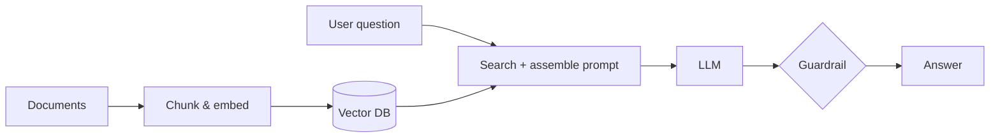
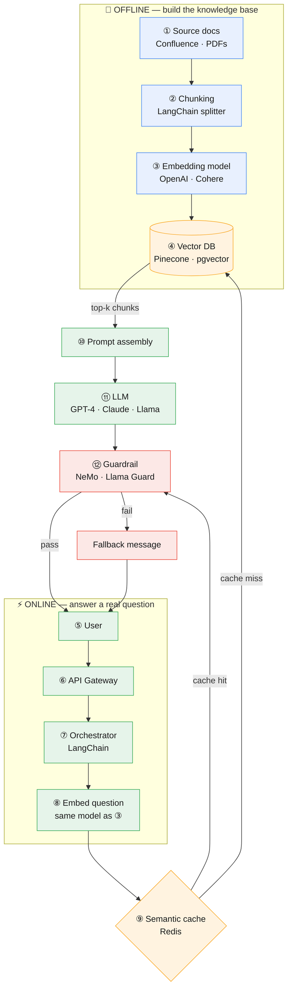

# LLM and RAG Architecture

**Prev:** [[01 - ML System Architecture]] · **Next:** [[03 - Backend Microservices and API Architecture]]

---

## The idea, in one sentence

An LLM by itself only knows what it saw during training, which can be months old and never includes your company's private data. **RAG (Retrieval-Augmented Generation)** fixes this by, on every question, first *searching* your own documents for relevant pieces of text, then handing those pieces to the LLM as extra context and saying "answer using this." So there are really two pipelines here too: one that **builds a searchable index** of your documents (offline, like ML training), and one that **answers a live question** using that index (online, like ML serving).

---

## Legend

🔵 Offline (indexing) &nbsp;·&nbsp; 🟢 Online (per-question) &nbsp;·&nbsp; 🟠 Data store &nbsp;·&nbsp; 🔴 Guardrail / safety

---

## Quick overview

| Block | In one sentence |
|-------|-------------------|
| **Documents** | Your internal knowledge — the stuff the LLM was never trained on. |
| **Chunk & embed** | Cut into small pieces and turn each one into a searchable set of numbers, ahead of time. |
| **Vector DB** | Stores those pieces so the ones closest in meaning to a question can be found instantly. |
| **User question** | Gets turned into the same kind of searchable numbers as the documents. |
| **Search + assemble prompt** | Pulls the most relevant chunks and packages them with the question into one message. |
| **LLM** | Generates an answer, grounded in the chunks it was given — not just its training memory. |
| **Guardrail** | Checks the answer is safe and actually supported by the retrieved chunks before it ships. |

---

## Detailed diagram

---

## Step-by-step walkthrough

**① Source documents.** Whatever knowledge you want the LLM to be able to answer from, but that it wasn't trained on: your internal wiki, product manuals, past support tickets. **Example tech:** Confluence, Notion export, Google Drive, plain PDFs.

**② Chunking.** You can't hand a 50-page PDF to the model on every question — it's too big and mostly irrelevant. So documents get cut into small overlapping pieces (e.g. ~500 words each) ahead of time, so later you can retrieve just the 3-5 pieces that actually matter. **Example tech:** LangChain's `RecursiveCharacterTextSplitter`, or a custom script.

**③ Embedding model.** A model whose only job is to turn a piece of text into a list of a few hundred/thousand numbers (a "vector") such that texts with similar *meaning* end up as similar numbers — even if they don't share any of the same words. This is what makes searching by meaning possible, instead of just keyword matching. **Example tech:** OpenAI's `text-embedding-3-small`, Cohere Embed, or an open-source model like `all-MiniLM`.

**④ Vector database.** A database built specifically to store these number-lists and answer the question "which stored vectors are closest to this new vector?" extremely fast, even across millions of chunks. **Example tech:** Pinecone (managed), pgvector (a Postgres extension — good if you already run Postgres), Weaviate, or FAISS (a library, not a hosted DB — good for small/local projects).

**⑤ User.** Someone typing a question into a chat interface, e.g. "What's our refund policy for enterprise customers?"

**⑥ API Gateway.** Same role as in any backend: checks the caller is authenticated and isn't sending too many requests.

**⑦ Orchestrator.** The piece of code that runs the whole RAG sequence in order: embed the question, search, assemble the prompt, call the LLM, check the output. Also keeps track of conversation history across turns. **Example tech:** LangChain, LlamaIndex, or often just hand-written Python — the "orchestrator" doesn't have to be a fancy framework.

**⑧ Embed the question.** The user's question gets turned into a vector using the **same** embedding model used in step ③. If you use a different model here, the numbers won't be comparable and search quality collapses — this is a very common bug.

**⑨ Semantic cache.** Before doing an expensive vector search + LLM call, check: has someone asked a nearly identical question recently? If yes, reuse that answer instead of paying for another LLM call. **Example tech:** Redis storing recent question-embeddings and their answers.

**④ (again) Vector database search.** On a cache miss, the question's vector is compared against every chunk vector stored in step ④, and the closest matches (say, top 5) are returned — these are the pieces of text most likely to contain the answer.

**⑩ Prompt assembly.** All the pieces get combined into one final message to the LLM: instructions ("answer only using the context below"), the retrieved chunks, the recent chat history, and the user's actual question. This combined message must fit inside the model's **context window** (its maximum input length).

**⑪ LLM.** The actual language model that reads the assembled prompt and generates an answer. **Example tech:** a hosted API like GPT-4 or Claude, or a self-hosted open model like Llama 3 (more control and privacy, more infrastructure work).

**⑫ Output check (guardrails).** Before the answer is shown to the user, it's screened: does it contain something unsafe, does it look like it made something up instead of using the retrieved context (hallucination), does it leak sensitive data? If it fails, the user gets a safe fallback message instead. **Example tech:** NVIDIA NeMo Guardrails, Meta's Llama Guard, or in simpler systems, a rules-based filter someone wrote by hand.

---

## Adapting a model to your data — pick the right tool

| Approach | What it actually changes | Cost | Real example |
|----------|-----------------------------|------|----------------|
| **Prompt engineering** | Just the instructions you send each time — the model itself doesn't change | Lowest — no training, just better wording/examples in the prompt | "Always answer in bullet points and cite the source" |
| **RAG** | What information the model has access to, per-question | Medium — need a vector DB + pipeline, but no model training | Answering questions about last week's product update, which the model was never trained on |
| **Fine-tuning** | The model's weights themselves — it permanently "learns" a style or skill | High — needs training data, GPU time, ML expertise | Teaching a model to always respond in your company's exact tone and format, without needing to repeat that instruction every time |
| **RAG + fine-tuning** | Both — fine-tune the style/behavior, RAG for facts | Highest | A legal-assistant product that must both sound precise (fine-tuned) and cite real, current case law (RAG) |

---

## Plain RAG vs an Agent

| | Plain RAG (steps ⑤–⑫ above) | Agent |
|---|-------------------------------|-------|
| **What decides what happens next** | Fixed sequence, always: search → generate | The LLM itself decides, step by step, what to do next |
| **What it can do** | Only answer using retrieved text | Can also take actions: call a calculator, run code, hit an API, do another search based on what it just found |
| **Real example** | "What's our refund policy?" → one search, one answer | "Book me the cheapest flight to Bogotá next Friday" → search flights, compare prices, call a booking API, confirm with the user |
| **Risk** | Low — it can only talk | Higher — it can take real actions, so it needs step limits, logging of every action, and stricter guardrails |

---

## Common traps

| Trap | Why it's wrong | What to say instead |
|------|------------------|----------------------|
| Sending an entire 50-page document as context | Wastes the context window, buries the relevant part, costs more per call | "Chunk it and retrieve only the top-k relevant pieces" |
| Using vector search results directly, with no re-ranking | Vector search is good at finding *plausibly related* text, not necessarily the *best* text | "Add a re-ranking step on the top ~20 results to pick the best 3-5" |
| Assuming RAG stops hallucination completely | The model can still ignore the retrieved context and make something up | "RAG reduces hallucination by grounding the answer, but you still need an output guardrail to catch it" |
| Letting an agent call tools with no limit | It can loop forever or rack up cost/damage | "Cap the number of steps, log every tool call, add timeouts" |
| Shipping prompt changes with no way to measure impact | You can't tell if a change to the prompt/retrieval helped or hurt | "Keep a fixed set of real test questions (an eval set) and check the answers every time something changes" |

---

## Interview one-liner

> "Offline, I chunk and embed the documents into a vector database. Online, the user's question gets embedded with the same model, checked against a semantic cache, then used to search the vector DB for the top relevant chunks — those get assembled into a prompt with chat history and sent to the LLM, and the output passes through a guardrail before reaching the user. RAG solves freshness and grounding; fine-tuning solves style and behavior — they solve different problems and can be combined."

---

**Next:** [[03 - Backend Microservices and API Architecture]]
