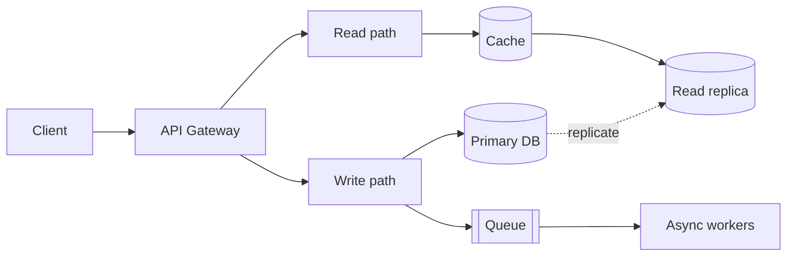
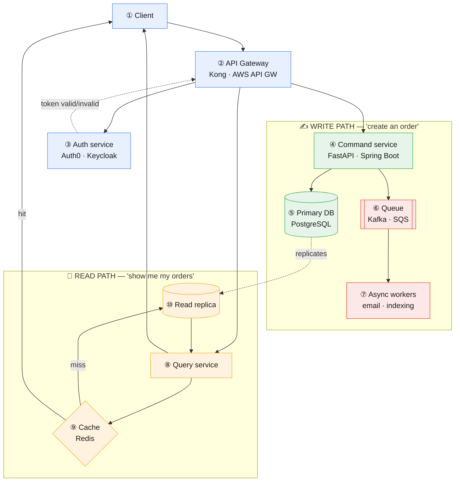

# Backend, Microservices and API Architecture

**Prev:** [[02 - LLM and RAG Architecture]] · **Next:** [[04 - Data and Analytics Platform Architecture]]

---

## The idea, in one sentence

Every backend answers three questions the same way: **who's allowed to make this request** (auth, at the front door), **is this a write or a read** (they're usually handled differently because they scale differently), and **what happens if something downstream is slow or down** (resilience). Everything below is just different ways of answering those three questions.

---

## Legend

🔵 Gateway / entry &nbsp;·&nbsp; 🟢 Write path &nbsp;·&nbsp; 🟠 Read path &nbsp;·&nbsp; 🔴 Async / queue

---

## Quick overview

| Block | In one sentence |
|-------|-------------------|
| **Client** | Whatever is making the request — a mobile app, a website. |
| **API Gateway** | The single front door: checks who you are and routes you to the right place. |
| **Write path** | Handles anything that changes data, e.g. "create this order." |
| **Primary DB** | The one place holding the real, current state — every write lands here first. |
| **Queue → Async workers** | Slow side effects (emails, search indexing) happen after the response, not during it. |
| **Read path** | Handles anything that only looks at data, e.g. "show me my orders." |
| **Cache → Read replica** | Reads are served fast, without adding load to the database that's busy handling writes. |

---

## Detailed diagram

---

## Step-by-step walkthrough

**① Client.** Whatever is making the HTTP request: a mobile app, a website's frontend, or another service.

**② API Gateway.** The single front door every request goes through first. It doesn't contain business logic — its job is auth, rate limiting (blocking someone sending 10,000 requests/second), and routing the request to the right internal service. **Example tech:** Kong, AWS API Gateway, NGINX — or in a small system, just the top-level router of your one FastAPI app.

**③ Auth service.** Checks whether the caller is who they say they are (a valid, unexpired login token) and what they're allowed to do. Often a separate service so every other service can just ask "is this token valid?" instead of re-implementing login logic. **Example tech:** Auth0, AWS Cognito, Keycloak, or a custom service issuing JWTs.

**④ Command service (write path).** Handles anything that *changes* data — "place this order," "update this profile." Named "command" because CQRS-style systems (see [[05 - Event-Driven CQRS and Scalability Patterns]]) deliberately separate write logic from read logic. **Example tech:** any web framework — FastAPI, Spring Boot, Express.

**⑤ Primary database.** The one place that holds the real, current, correct state of your data. All writes go here first. **Example tech:** PostgreSQL, MySQL.

**⑥ Message queue.** After saving the order, the command service doesn't personally send the confirmation email or update the search index — that would make the user wait for things they don't need to wait for. Instead, it drops a message ("OrderCreated") onto a queue and moves on immediately. **Example tech:** Kafka (high throughput, keeps history), RabbitMQ (simpler, classic task queue), AWS SQS (fully managed).

**⑦ Async workers.** Separate processes that sit and listen to the queue, and do the slower, non-urgent work whenever a message arrives: sending an email, updating a search index, generating a PDF invoice. If a worker crashes, the message queue keeps the message so it can be retried — the user's original request already succeeded and returned instantly.

**⑧ Query service (read path).** Handles anything that only *reads* data — "show me my last 10 orders." Kept separate from the command service because reads happen far more often than writes in most apps, and can be optimized/scaled independently (caching, replicas) without touching the write logic at all.

**⑨ Cache.** A very fast, in-memory store checked before touching the database at all. If the data was requested recently and hasn't changed, it's returned straight from memory — no database query needed. **Example tech:** Redis, Memcached.

**⑩ Read replica.** On a cache miss, instead of querying the primary database (and adding load to the same database that's trying to handle writes), the query service reads from a replica — a continuously updated copy of the primary, dedicated to reads only. This is why the primary DB (⑤) has a dotted arrow into it: data flows one way, primary → replica, automatically, in the background.

---

## Monolith vs microservices

| | Monolith | Microservices |
|---|----------|----------------|
| **What it is** | One codebase, one deployable unit, usually one database | Many small, independently deployable services, each owning its own data |
| **Real example** | A startup's whole product (API + business logic + DB access) is one Django/FastAPI app | Amazon's checkout, inventory, and recommendations are separate services, each with its own team and database |
| **When it's the right call** | Almost always, at first — simpler to build, test, deploy, and debug | Once a real problem shows up: one team's deploys are blocking another's, or one part needs to scale 100x more than the rest |
| **What you give up by splitting** | Nothing yet | Network calls where there used to be function calls, harder debugging (one request now touches 5 services), eventual consistency between services |

---

## Synchronous vs asynchronous calls between services

| | Synchronous (e.g. REST or gRPC call) | Asynchronous (e.g. via the message queue) |
|---|----------------------------------------|----------------------------------------------|
| **When to use it** | The caller genuinely needs the answer before it can respond to the user (e.g. "is this payment authorized?") | The caller doesn't need to wait (e.g. "send a receipt email") |
| **What happens if the other service is down** | The caller's request fails or hangs, unless you've added a timeout | The message just waits safely in the queue until a worker is available again |
| **Coupling** | Tight — both services must be up at the same time | Loose — the queue absorbs the outage |

---

## Keeping the system alive when a dependency fails

| Pattern | The problem it solves | Plain explanation | Real example |
|---------|-------------------------|---------------------|----------------|
| **Timeout** | A slow dependency hangs your request forever | "Give up waiting after N seconds instead of waiting indefinitely" | Payment provider is slow today — don't let every checkout hang for 2 minutes, fail fast at 5 seconds instead |
| **Retry (with backoff)** | A dependency fails once, briefly, then recovers | "Try again after a short wait, since many failures are temporary" | A network blip causes one failed call — retrying 1 second later succeeds |
| **Circuit breaker** | A dependency is fully down, and retrying just makes it worse | "After enough failures in a row, stop calling it for a while and fail fast instead" | Your recommendation service is down — stop hammering it for 30 seconds so it has room to recover, show a generic fallback instead |
| **Bulkhead** | One slow dependency uses up all your resources, breaking unrelated features too | "Give each dependency its own separate pool of connections/threads, like a ship's watertight compartments" | The email service is stuck — because it has its own connection pool, checkout (which doesn't need email) keeps working fine |
| **Idempotency key** | A retried request accidentally happens twice (e.g. double-charges a card) | "Tag each write request with a unique ID so doing it twice has the same effect as doing it once" | The client's confirmation didn't arrive so it retries "place order" — the server sees the same idempotency key and returns the original order instead of creating a duplicate |

---

## Common traps

| Trap | Why it's wrong | What to say instead |
|------|------------------|----------------------|
| "Let's use microservices, it's more scalable" | Adds real complexity (network calls, distributed debugging) that most apps don't need yet | "I'd start with a monolith and split out a service only once there's a concrete bottleneck — team size, or one part needing very different scaling" |
| A request that calls service A, which calls B, which calls C, all synchronously | If C is slow, the whole chain is slow; if C is down, the whole chain fails | "Keep synchronous chains short; anything that doesn't need to block the response goes through the queue" |
| No timeout on a call to another service | One slow dependency can silently hang your entire system | "Every network call needs an explicit timeout, plus retry/circuit-breaker logic" |
| Two microservices sharing one database | Defeats the purpose of splitting them — a schema change in one now silently breaks the other | "Each service owns its own data; others access it through an API or by subscribing to its events" |
| A cache with no expiration or invalidation plan | Users see stale data forever, or the cache slowly fills up with garbage | "Set a TTL, or explicitly clear the cache entry when the underlying data changes" |

---

## Interview one-liner

> "The gateway is the single front door for auth and rate limiting. Writes go through a command path that persists to the primary database and publishes an event, so slow side effects like emails happen asynchronously via a queue instead of blocking the response. Reads go through a separate query path backed by a cache and a read replica, so they don't compete with writes for database load. Any call between services gets a timeout, retries, and a circuit breaker, so one slow dependency can't take down the whole system."

---

**Next:** [[04 - Data and Analytics Platform Architecture]]
