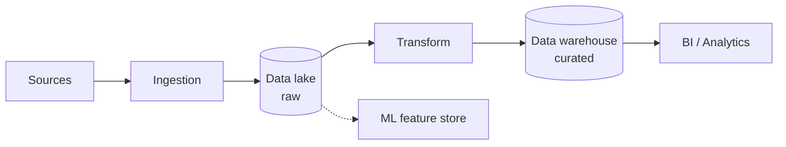
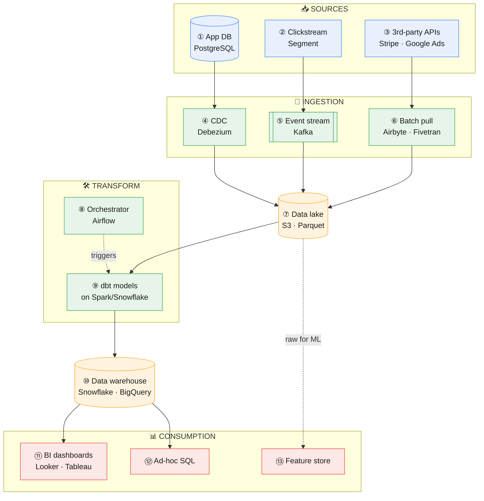

# Data and Analytics Platform Architecture

**Prev:** [[03 - Backend Microservices and API Architecture]] · **Next:** [[05 - Event-Driven CQRS and Scalability Patterns]]

---

## The idea, in one sentence

A data platform's whole job is moving data from **where it's produced** (the app's production database, user clicks, third-party tools) to **where it's trusted enough to make decisions from** (a dashboard, a report to the CEO) — and the golden rule is: **always keep an untouched copy of the raw data**, because every transformation step is a place a bug can quietly corrupt numbers, and you need to be able to redo it from scratch.

---

## Legend

🔵 Sources &nbsp;·&nbsp; 🟢 Ingestion / transform &nbsp;·&nbsp; 🟠 Data store &nbsp;·&nbsp; 🔴 Consumption

---

## Quick overview

| Block | In one sentence |
|-------|-------------------|
| **Sources** | The app database, user clicks, and third-party tools — where data is actually produced. |
| **Ingestion** | Moves that data out into the platform without slowing down the live app. |
| **Data lake (raw)** | A cheap, untouched copy of everything — your insurance policy if a transform step ever has a bug. |
| **Transform** | Cleans, joins, and aggregates raw data into tables people can actually trust. |
| **Data warehouse (curated)** | The modeled tables the rest of the company is allowed to query directly. |
| **BI / Analytics** | Dashboards and analysts consuming the curated data. |
| **ML feature store** | The same curated (and sometimes raw) data also feeds machine learning — see [[01 - ML System Architecture]]. |

---

## Detailed diagram

---

## Step-by-step walkthrough

**① App database.** The live database your actual product reads and writes to, moment to moment. **Example tech:** PostgreSQL, MySQL, MongoDB.

**② Clickstream events.** User actions in your app or website, sent as small messages the instant they happen — "user viewed product X," "user clicked add-to-cart." **Example tech:** sent via a tracking library (e.g. Segment) into an event stream.

**③ Third-party APIs.** Data you don't own but need for analysis — how much you spent on ads, what payments came in. **Example tech:** Stripe's API, Google Ads API, Salesforce.

**④ CDC (Change Data Capture) tool.** Instead of running heavy `SELECT * FROM orders` queries against your live production database (which would slow it down), a CDC tool reads the database's internal transaction log — the same mechanism the database uses for its own replication — and streams out every row that changed, with almost no load on the production database. **Example tech:** Debezium (open source, very common), or a managed equivalent from your cloud provider.

**⑤ Event stream.** A durable, ordered pipe that events get pushed into the instant they happen, and that multiple downstream systems can read from independently. **Example tech:** Kafka (self-managed or via Confluent), AWS Kinesis.

**⑥ Scheduled batch pull.** For data you don't need instantly — like yesterday's ad spend — a job just runs once a day, calls the third-party API, and drops the result somewhere. **Example tech:** Airbyte, Fivetran (both are pre-built connectors for hundreds of common APIs, so you don't write this by hand).

**⑦ Data lake.** Cheap, flexible storage that holds the raw data, exactly as it arrived, forever. "Flexible" means it doesn't require a fixed schema like a traditional database — you can dump JSON, CSV, or Parquet files in as-is. This is your insurance policy: if a transformation bug corrupts your warehouse tables next month, you can always reprocess from here. **Example tech:** files in Amazon S3 or Google Cloud Storage, usually saved in the Parquet format (compressed, fast to query).

**⑧ Orchestrator.** The scheduler that knows the full dependency graph of your data jobs — "table B can't be built until table A finishes" — and runs them in the right order, retries failures, and alerts someone if a step breaks. **Example tech:** Apache Airflow, Dagster.

**⑨ Transform.** The actual SQL/code that turns raw, messy data into clean, well-named, joined, aggregated tables — e.g. combining raw click events with the orders table to build a "conversion rate per campaign" table. **Example tech:** dbt (the industry standard for writing these transformations as version-controlled SQL), running on compute like Spark or directly inside the warehouse.

**⑩ Data warehouse.** A database optimized specifically for large analytical queries (scanning millions of rows fast), holding the clean, modeled, documented tables that the rest of the company is allowed to query directly. **Example tech:** Snowflake, Google BigQuery, Amazon Redshift.

**⑪ BI dashboards.** Pre-built visual reports non-technical people check regularly — "monthly active users," "revenue this quarter." **Example tech:** Looker, Tableau, Metabase, Power BI.

**⑫ Ad-hoc SQL.** An analyst or data scientist directly querying the warehouse to answer a one-off question that doesn't have a dashboard yet.

**⑬ Feature store.** The same curated, trustworthy data also gets used to build features for machine learning models — this is the bridge to [[01 - ML System Architecture]]. Notice it can read from the raw lake too, since ML sometimes needs data at a level of detail the warehouse has already aggregated away.

---

## Batch (Lambda) vs streaming-first (Kappa) architecture

| | Lambda architecture | Kappa architecture |
|---|----------------------|----------------------|
| **The idea** | Build the system twice: a slow, accurate **batch path** (reprocesses everything nightly) and a fast, approximate **speed path** (streaming, for up-to-the-minute numbers) | Build it once: everything is a stream. "Batch" just means replaying the stream from the beginning |
| **Why it exists** | Older systems needed real-time numbers but batch tools were the only accurate ones available | Modern stream processors (e.g. Kafka Streams, Flink) became accurate and reliable enough to be the only path needed |
| **Downside** | You maintain two codebases doing similar logic — they can drift out of sync and disagree | Simpler to maintain, but requires the whole team to think in "streams" |
| **Real example** | A dashboard shows an approximate live count from the speed path, corrected by the accurate batch path a few hours later | A single Flink job computes the metric once, correct from the start, no reconciliation needed |

---

## Data lake vs data warehouse vs lakehouse

| | Data lake | Data warehouse | Lakehouse |
|---|-----------|-----------------|-----------|
| **What's stored** | Raw data, any format, no fixed schema | Structured, modeled tables only | Structured tables, but stored using lake-style cheap storage underneath |
| **Cost per TB** | Cheap | More expensive | Cheap (lake storage) + warehouse-like guarantees |
| **Who queries it directly** | Data engineers, ML pipelines | Analysts running BI/SQL | Both — one storage layer serves both use cases |
| **Real example** | S3 bucket full of Parquet files | Snowflake tables that feed Looker dashboards | Databricks with Delta Lake, or Apache Iceberg tables |

---

## Common traps

| Trap | Why it's wrong | What to say instead |
|------|------------------|----------------------|
| Transforming data on the way in, never keeping a raw copy | If the transformation logic had a bug, or requirements change, there's no way to redo it correctly | "Land the data raw and untouched first — transform in a separate, repeatable step" |
| No automated tests on the curated tables | A silent bug (e.g. a broken join) can quietly make a dashboard wrong for weeks before anyone notices | "Add data quality tests — e.g. dbt tests checking 'this column is never null,' 'revenue is never negative'" |
| BI dashboards querying the raw data lake directly | The lake isn't optimized for fast analytical queries and doesn't have clean, documented tables | "That's exactly what the warehouse layer is for — BI tools should query curated tables, not raw files" |
| One giant nightly job that does everything | If step 7 out of 10 fails, you don't know if steps 1-6 are safe to keep, and you can't tell what to rerun | "Break it into an orchestrated DAG with clear dependencies, so a failure only reruns what actually needs it" |
| Ignoring that upstream data formats change | A producer team adds/renames a field and your pipeline breaks silently, or worse, doesn't break and just computes wrong numbers | "Version and validate schemas at ingestion, don't assume upstream stays constant" |

---

## Interview one-liner

> "Raw data lands untouched in a data lake — via CDC for the app database, streaming for events, and batch pulls for third-party APIs — because I never want to lose the ability to reprocess from scratch. An orchestrator like Airflow schedules dbt to transform that raw data into clean, tested tables in a warehouse, which is what BI dashboards and analysts actually query. That same curated layer feeds a feature store for ML, so both sides of the company are working from the same trusted numbers."

---

**Next:** [[05 - Event-Driven CQRS and Scalability Patterns]]
