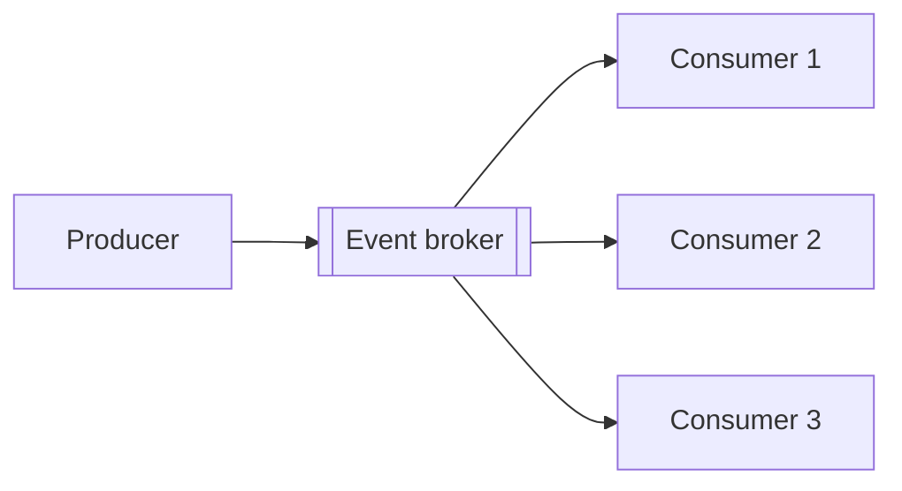
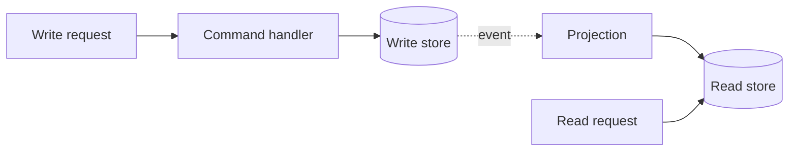
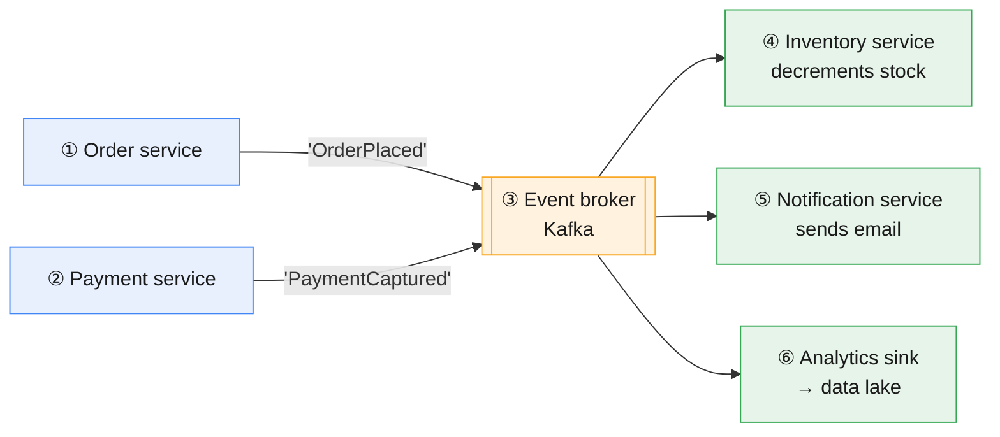
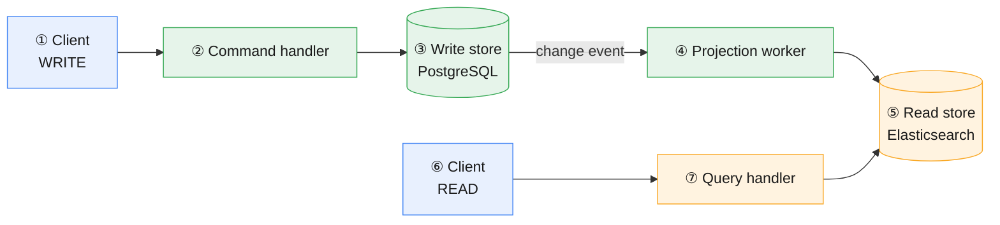

# Event-Driven, CQRS and Scalability Patterns

**Prev:** [[04 - Data and Analytics Platform Architecture]]

---

## The idea, in one sentence

This is the "how do you make it handle more load" toolbox: **events** let services announce facts without needing to know who's listening, **CQRS** lets your read traffic and write traffic scale on completely separate tracks, and the classic scaling patterns (cache, replica, shard, load balancer) each fix one specific bottleneck — the skill isn't memorizing the list, it's correctly diagnosing *which* bottleneck you actually have before reaching for one.

---

## Legend

🔵 Producer / client &nbsp;·&nbsp; 🟢 Write side &nbsp;·&nbsp; 🟠 Store / broker &nbsp;·&nbsp; 🔴 Consumer / read side

---

## Quick overview — event-driven

| Block | In one sentence |
|-------|-------------------|
| **Producer** | A service announcing that something happened — it has no idea who, if anyone, is listening. |
| **Event broker** | A durable, ordered log of every event, that any number of consumers can read independently. |
| **Consumers** | Each reacts on its own; a brand-new consumer can be added without ever touching the producer. |

---

## Quick overview — CQRS

| Block | In one sentence |
|-------|-------------------|
| **Write request** | Something that changes data, e.g. "update my address." |
| **Command handler** | Validates the request; the only thing allowed to touch the write store. |
| **Write store** | Normalized source of truth — safe and consistent, but not shaped for fast reading. |
| **Projection** | Listens for changes and updates a second, read-friendly copy. |
| **Read store** | Denormalized, pre-shaped exactly like the screen that displays it — one fast lookup, no joins. |
| **Read request** | Goes straight to the read store — never touches the write side at all. |

---

## Detailed diagram — event-driven backbone

---

## Detailed diagram — CQRS

---

## Step-by-step walkthrough — event-driven backbone

**① / ② Producers.** Any service that has something happen worth announcing. It doesn't send a request to anyone specific — it just publishes a fact: "this order was placed." **Example tech:** any backend service, using a Kafka client library to publish.

**③ Event broker.** The central hub. It's not just a message-passer — it keeps a durable, ordered, replayable log of every event, so a new consumer added six months from now can still read everything that happened, and existing consumers can be restarted without losing anything. **Example tech:** Kafka (the industry default), or a managed equivalent like AWS Kinesis / Confluent Cloud.

**④, ⑤, ⑥ Consumers.** Each service listens for the events it cares about and reacts independently — the order service never had to know the inventory service, notification service, or analytics pipeline even exist. This is the actual payoff of event-driven design: **you can add a brand-new consumer (⑥ was added later) without touching the producer at all.**

---

## Step-by-step walkthrough — CQRS

**① Client sends a write.** Something that changes data — updating a shipping address, placing an order.

**② Command handler.** Validates the request (is this a real order? is the address well-formed?) and is the only thing allowed to write to the primary store.

**③ Write-optimized store.** A normal, normalized database — the source of truth. "Normalized" means each piece of data is stored once, avoiding duplication, which makes writes safe and consistent, but often means a read needs several joins to assemble a full picture.

**④ Projection worker.** Listens for the change (often via the same kind of event broker as diagram 1) and updates a second copy of the data, reshaped for reading.

**⑤ Read-optimized store.** A denormalized copy — pre-joined, pre-shaped exactly like the screen that will display it, so a read is a single fast lookup instead of five joined queries. **Example tech:** Elasticsearch, a separate read-replica table, or even a Redis hash.

**⑥ / ⑦ Client sends a read.** Reads never touch the write-optimized store at all — they go straight to the fast, pre-shaped read store.

**The catch:** there's a small delay between ② (the write happens) and ⑤ (the read store reflects it) — this is called **eventual consistency**, and it's a deliberate tradeoff you're making for speed, not a bug.

---

## Other concepts worth knowing

| Concept | Plain explanation | Real example |
|---------|----------------------|----------------|
| **Event sourcing** | Instead of storing "the current state," store every event that ever happened, and calculate current state by replaying them | A bank account's balance isn't a stored number — it's the sum of every deposit/withdrawal event, so you always have a full audit trail |
| **Saga pattern** | A way to handle a transaction that spans multiple services (which can't share one database transaction) using a sequence of events plus "undo" steps if something fails partway | Booking a trip = reserve flight + reserve hotel + charge card. If the hotel reservation fails, a "compensating" event cancels the flight reservation that already succeeded |

---

## Scalability patterns

| Pattern | What bottleneck it fixes | Plain explanation | Tradeoff |
|---------|------------------------------|----------------------|-----------|
| **Horizontal scaling** | Too much traffic for one server | Run many copies of the same service behind a load balancer, instead of buying one bigger server | Each copy must be stateless — no storing session data in server memory |
| **Load balancing** | Distributing traffic across those copies | A component that sits in front and spreads incoming requests evenly. **Example tech:** NGINX, AWS ELB | Needs health checks so it stops sending traffic to a broken instance |
| **Caching** | Repeated, expensive reads | Store the answer to a common question in fast memory instead of recomputing it every time | The hard part isn't storing it — it's knowing when to invalidate it once the underlying data changes |
| **Sharding / partitioning** | A single database can't hold or serve all the data | Split data across multiple databases by some key (e.g. user ID range), each holding a slice | Queries that need data from two different shards (e.g. "join user A and user B's data") become much harder |
| **Read replicas** | Too many reads for one database | Keep live copies of the primary database dedicated only to serving reads | Replication takes a moment, so a replica can serve slightly stale data right after a write |
| **Rate limiting** | Protecting the system from abuse or accidental overload | Cap how many requests a single client can make in a time window | Set the limit too low and you throttle legitimate heavy users, not just abusers |

---

## CAP theorem, in practical terms

When part of your system loses network connection to another part (a **partition** — this *will* happen eventually), you have to choose:

| Choice | What you get | What you give up | Real example |
|--------|----------------|---------------------|----------------|
| **CP** — Consistency + Partition tolerance | Every read reflects the latest write, guaranteed | Availability — during the partition, the system may refuse requests rather than risk showing wrong data | A bank ledger — better to reject a transaction than risk an incorrect balance |
| **AP** — Availability + Partition tolerance | The system keeps responding to every request, always | Consistency — you might read slightly stale data | A social media feed — showing a post that's 10 seconds old is fine; refusing to load the app is not |

*You don't pick CP or AP for your whole company — you pick it per piece of the system, based on what that specific piece can tolerate.*

---

## Common traps

| Trap | Why it's wrong | What to say instead |
|------|------------------|----------------------|
| "Just add a cache" as the answer to every performance question | A cache only helps *reads* — if the bottleneck is writes, it does nothing | "First I'd find out if the bottleneck is reads or writes, then pick the pattern that actually fixes that" |
| Sharding the database early, "to be safe" | Sharding is hard to undo and makes cross-shard queries much harder — most systems never need it | "I'd exhaust vertical scaling and read replicas first; sharding is usually a last resort, not a starting point" |
| Publishing events with no schema or versioning | If a producer changes the shape of an event, every consumer can silently break | "Events need a versioned schema, just like an API contract" |
| Using CQRS everywhere by default | It adds real complexity — eventual consistency, two separate data models to keep in sync | "I'd only reach for CQRS where read and write patterns genuinely diverge a lot, e.g. very read-heavy with complex UI-specific views" |
| Treating eventual consistency as a bug to be fixed | It's a conscious tradeoff for availability/scale, not a mistake | "I'd design the UI/UX to account for it — e.g. optimistic updates — rather than trying to force strong consistency everywhere" |

---

## Interview one-liner

> "I'd decouple services with an event broker so new consumers can be added without touching the producer. If read and write patterns genuinely diverge, I'd split them with CQRS — writes go to a normalized store, and a projection keeps a denormalized read store in sync, accepting eventual consistency as the tradeoff for speed. Beyond that, I add caching, replicas, or sharding only after confirming, with actual data, which one — reads or writes — is the real bottleneck."

---

[[00 - Chapter Overview|← Chapter Overview]]
